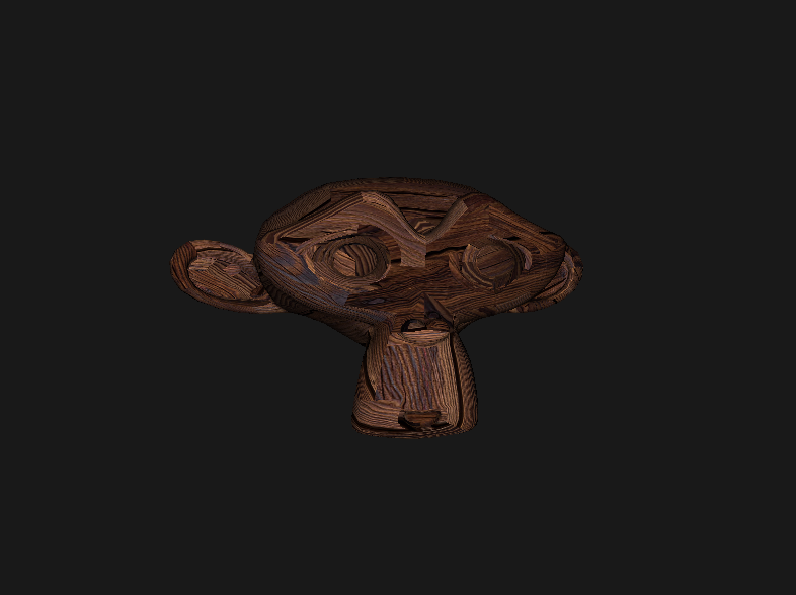

# OpenGL Lab
Experimental code using OpenGL via GLEW, GLM, SDL2 and GLFW to test basic aspects of OpenGL and shading via glsl. Currently displays a single rotating object in a window.

## Features and Information
  - Window creation
  - Shader compilation
  - Mesh creation (hard coaded vertices or .obj file loading)
  - Support for textures
  - 3D motion (translation, rotation and scaling)
  - Camera system with perspective projection
  - Lambertian shading

A test object and texture are provided in the resources file, along with a basic vertex and fragment shader.

## Install Guide

It is recommended to follow the installation for your specific platform, building from source is not recommended. Windows installation is not currently supported.

The binary, once built with `make` can be found in `./build/bin`

### MacOS
```
$ brew install glew glm glfw sdl2
$ git clone https://github.com/fraserlove/opengl-lab.git
$ cd opengl-lab
$ make
```

### Debian / Ubuntu
```
$ sudo apt install libglew-dev libglm-dev libglfw3-dev libsdl2-dev
$ git clone https://github.com/fraserlove/opengl-lab.git
$ cd opengl-lab
$ make
```

### Building from Source
Not recommended as not maintained regularly. For best support use pacakges above. This installs SDL, GLFW and GLEW under the `libs` folder and not on the users system. Hence no dependencies have to be uninstalled after you are done with the application.
```
$ git clone --recurse-submodules https://github.com/fraserlove/opengl-lab.git
$ cd opengl-lab
$ sudo make libs
$ make
```

The following shared libraries under `lib/` must be built before the main project can be built:
 - SDL `lib/SDL/build/.libs/libSDL2.so`
 - GLFW `lib/glfw/src/libglfw.so`
 - GLEW `lib/glew/lib/libGLEW.so`

## Screenshot
OpenGL experimental code preview:


